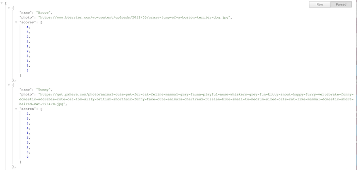
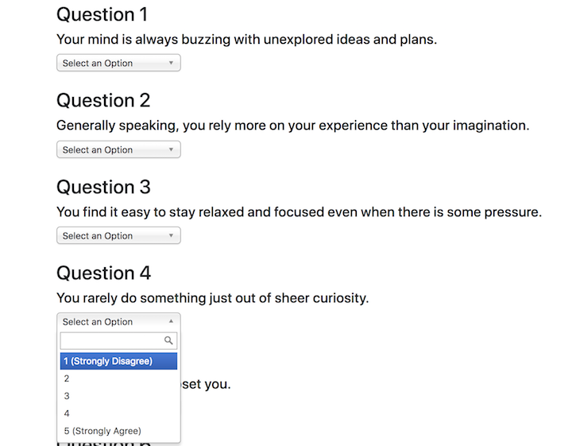
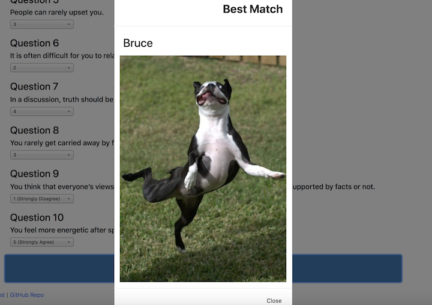

# FriendFinder

## Summary
The compatibility-based "FriendFinder" application is basically a dating app. This full-stack site will take in results from the users' surveys, then compare their answers with those from other users. The app will then display the name and picture of the user with the best overall match.

Please check out the deployed version through Heroku: [FriendFinder](https://cait-friendfinder.herokuapp.com/).

## Languages Used
This application uses Node.JS, Express.JS, Bodyparser.JS, and JavaScript.

## Introduction
Initially, the user begins on the home page that provides details about the survey page. It also includes an API Friends List and link to the GitHub code. The API Friends List simply provides the array of objects of each user's response to the questions and will update when new users fill out the survey.

## Survey Questions
Once the user navigates to the survey, he or she is required to fill out the name and image (using a link), along with a set of ten questions. A drop down for each question will allow the user to choose a number between one and five, based on his or her preferences.

## Survey Results
One the survey is completed and every answer is filled out, the user will be provided a match based on the answers. Hey, check it out - I matched with Bruce!

